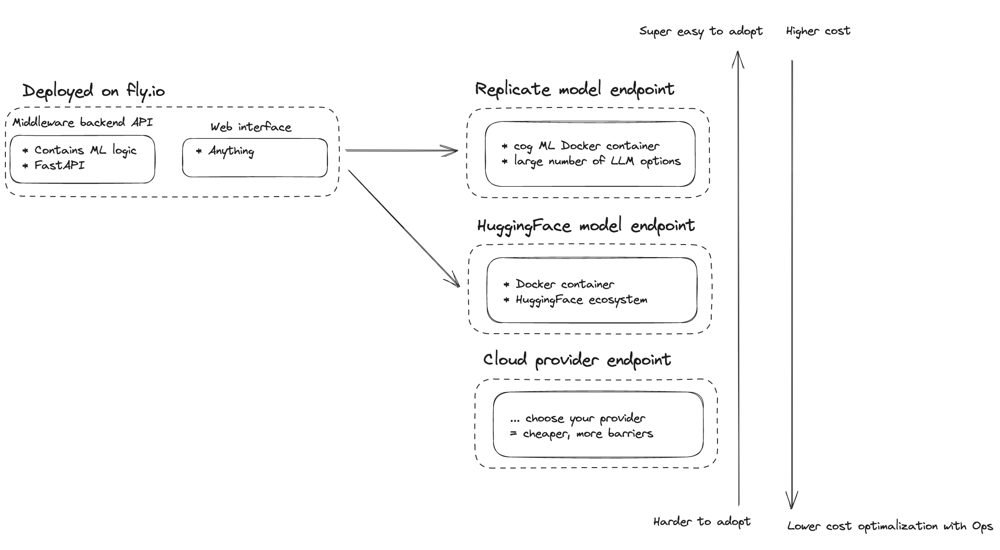
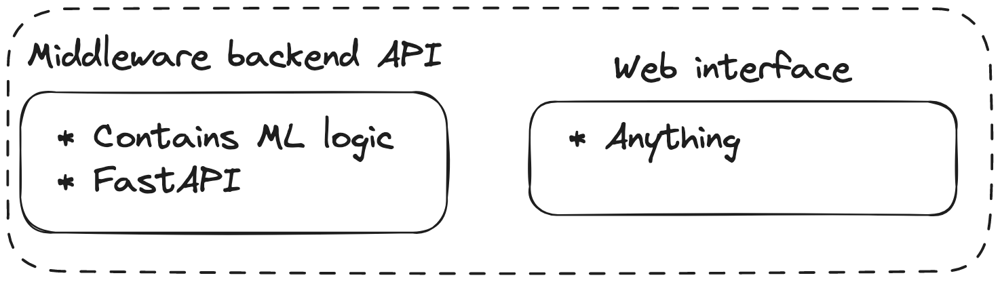

# serverless-llm-app-factory

__Not yet another LLM python package.__

This repository serves as a starting point to churn out serverless LLM web applications in minutes.

You're just getting started with LLMs or APIs? Take a look at the ["stupidly minimal guide"](https://blog.timleers.com/a-stupidly-minimal-llm-api-starterkit-deploy-llm-endpoints-in-a-minute-with-langchain-and-fastapi) accompanying [`llm-api-starterkit`](https://github.com/tleers/llm-api-starterkit) and return here afterwards.

* __Skip to [reference implementations](#reference-implementations) to see what potential serverless LLM apps look like, and what are the key takeaways in implementation__

* __Dive into [installation](#installation) to start developing your own serverless LLM app__

* __Test the example applications, by skipping to [local webapp deployment](#local-webapp-quickstart), or immediately [deploy a reference application on the web](#web-api-launch-quickstart)__

## __Premise__

Building and deploying new AI products to end-users is possible in minutes, if we leverage LLMs & serverless.

Building an AI product used to consist of three great obstacles on the technical domain: 

__(1)__ Data Preparation & Governance

__(2)__ Model Development

__(3)__ Deployment

With the ability of large language models (LLMs) to do zero-shot and few-shot learning from examples without application-specific training, it's possible to build new AI products in a couple of minutes, skipping model development if we assume:

__(1) data is ready and/or static, or not needed for our product__,

__we use a service to help us manage (3) deployment__

### Key value proposition

In this repository, I __focus on (3) deployment__.

We leverage a simple design pattern from [`llm-api-starterkit`](https://github.com/tleers/llm-api-starterkit) using LangChain & FastAPI for (2) model development.

__Deployment__ needs resources for back-end & front-end: 

We use back-end resources from __[Replicate](https://replicate.com/)__, a serverless model endpoint service, for the following key reasons:

* __Use any open-source LLM__: You can implement or adapt any existing open-source model and deploy it on Replicate with the fantastic cog template. Never mind, someone has likely already beat you to it, and you can leverage their implementation
* __Free of charge__: Just log in with GitHub, and you can use a limited amount of compute for free, ideal for getting started (unclear how much, never hit it with simple development)
* __Extremely beginner-friendly__: Using the LangChain integration, all you need to do is __[explore](https://replicate.com/explore) the model hub__ and copy the endpoint link into your application

Other considerations:
* __Easy access to other SOTA non-LLM models__: An active community of researchers & practictioners implements state of the art models, faster than almost any other open-source platform
* __Cheap to start, expensive to scale__: According to [inferless](https://www.inferless.com/serverless-gpu-market), one of the more expensive serverless GPU options to provide serverless compute for your preferred Large Language (and other ML) models without opting in to an opinionated ecosystem

For front-end deployment on the web, we leverage __[`fly.io`](https://fly.io/)__ to deploy our application on the web. No idea if this is the best option, but it:
* is very easy to deploy if you have a Docker container for your front-end
* has a free tier
* seems popular

### Design draft

So, what does the core idea look like?

<p align="center">
	
</p>

the `middleware` deployed on `fly.io` containing business logic is leveraging the simple pattern from [`llm-api-starterkit`](https://github.com/tleers/llm-api-starterkit):

<p align="center">
	
</p>

### An incomplete approach

* This is by no means a fully fledged guide to operationalize the development and maintenance of your deployed LLM-powered serverless application. 

* Cost optimization, inference speed, are not priorities in these examples, but will be some of the key considerations if you are building a user-facing product. 

* On top of that, we use no CI/CD, pre-commits, tests, anything slowing us down from deploying a first prototype or making sure our app is maintainable. Not recommended.

For a comprehensive guide to LLMOps, best practices & enterprise deployment... you'll have to wait until https://github.com/tleers/servelm is completed. 

## __Reference implementations__

Short descriptions and key considerations of the examples implemented in this repository. 

__To try the example applications out, skip to [local webapp quickstart](#local-webapp-quickstart), or immediately [deploy a reference application on the web](#web-api-launch-quickstart)__

### To-do extractor


TODO!

---

### LLM-enhanced text 2 music with Meta's MusicGen

_Text to music sample with Replicate, Vicuna & MusicGen_

1. User input music description
2. Vicuna LLM converts rich musical description
3. MusicGen converts rich musical description to music

**Pricing?** Replicate gives you a couple of free tries before they ask for a credit card (I presume, they never asked me). 

* The cost is less than 0.10$ per sample when combining Vicuna & Audiocraft (`prompt-to-sample`endpoint)
* Estimated unit costs for the Audiocraft endpoint were: $0.00055 / second. Four samples cost me about $0.17.
* Estimated unit costs for the Vicuna-13b endpoint were: $0.0023 / second. Four samples cost about $0.08.
	
**Latency?** 5 to 15 seconds for the LLM, about 60-90 seconds for music sample generation.

* The LLM is deployed on Nvidia A100s. 
* The Audiocraft endpoint is deployed on Nvidia T4s. You could significantly improve latency by switching to A100s, and potentially optimize cost further.

---

### __LLM-powered creative agent that can create lyrics, music and music videos__

TODO 

## Local webapp quickstart

__You don't want to develop new apps yourself, but you're just interested in locally running a webapp in your browser? Start here.__

### __If you have Docker installed__

I recommend this route - it prevents dependency issues.

TODO README

### __If you do not have Docker installed__

TODO, finalize examples.

We assume that `poetry`, the go-to for dependency management and building modules in Python, is installed. If not, please [install Poetry first](https://python-poetry.org/docs/#installing-with-the-official-installer).

To launch the API for:
* to-do extraction
```console
sh todo_api.sh
```
* text 2 music sample
```console
sh custom_music_sample.sh
```
* custom music agent
```console
sh muzikagent_api.sh
```

## Web API Launch Quickstart

__You want to launch one of the existing apps on the web?__

Here we launch our API on the web. You need to connect fly.io to your github or email. You'll be prompted when executing the commands below.
```
curl -L https://fly.io/install.sh | sh
fly auth signup
```

Once you're logged in, launch the Web API of your choice. But wait: First add your Replicate API token.

```
flyctl secrets set REPLICATE_API_TOKEN=token
fly launch --image apps/todo_extractor/api.Dockerfile
```

Congratulations, your todo extractor API will go online at https://<name>.fly.dev/docs, with <name> the name you chose during the installation process in `fly launch`

You're finished testing it out and want to take it down?
```
flyctl scale count 0
```

## __Installation__

### Development

To develop your own applications, start:
```bash
poetry install
```

Alternatively, you can rely on trusty venv:
```bash
python3 -m venv venv
. venv/bin/activate
pip install -r requirements.txt
```

### Set up Replicate & fly.io

* Register on Replicate.com with your Github account.
* Copy your API token (left-click your username, then click API tokens)
* Paste the API token into your .secrets file
	* `REPLICATE_API_TOKEN=r8_***`


## PS

### Why not AWS, GCP, Azure, HuggingFace?

Already outlined above, Replicate is very easy to use and doesn't require a credit card to sign up - an active GitHub account seems to be enough to get access to limited free compute. On top of that, Replicate seems to have one of the fastest communities when it comes to picking up SOTA models and making them available for others to use. Their `cog` container template may be partially responsible for that.

* __AWS, GCP, Azure__ were not selected because these options require significantly more learning & effort to pick up and require a credit card (usually). 
* __Hugging Face__ is a strong contender, and ultimately probably the better choice for a product that you expect to scale. Cost-wise, integration wise, and maturity wise, it's a more optimal choice. However, it is not possible to use GPUs without credit card, and it has a significantly higher learning curve, in addition to its strongly community-supported, but ultimately, bloated ecosystem, making adoption of SOTA models somewhat slower and harder to maintain.
* __OpenAI__: __In practice probably the easiest and cheapest to build an application with presently__. Not selected because it's trivial to use (and demonstrated in `llm-api-starterkit`), because it requires a credit card, and we want to demonstrate other options.

### Hidden agenda

I'm building on different, larger products that could benefit from a reference repository that explains how to design and deploy LLM webapps. Okay, I want LLM-powered agents to build stuff for me.

